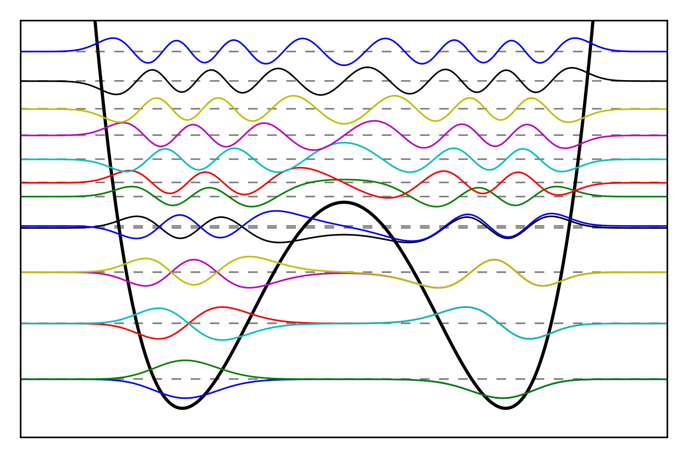

==============
Fourier DVR 1D
==============

Solves the Schroedinger equation on a finite one-dimensional interval using
the discrete variable representation method with the Fourier sine basis.
Requires Python, NumPy and SciPy, and optionally Matplotlib for plotting.

Source the `env.sh` file to use the package. See the `examples` directory for some
inspiration and colorful quantum mechanics.
